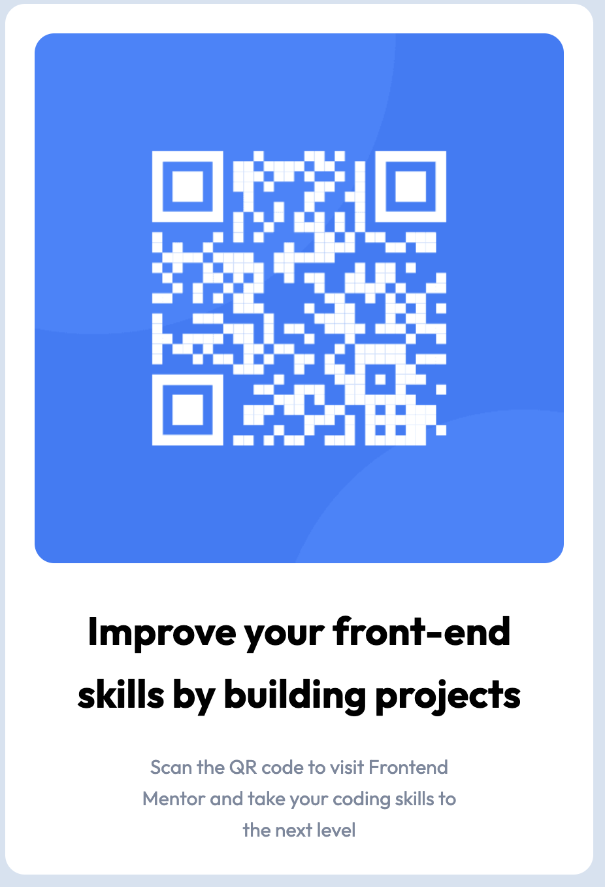

# Frontend Mentor - QR code component solution

This is a solution to the [QR code component challenge on Frontend Mentor](https://www.frontendmentor.io/challenges/qr-code-component-iux_sIO_H). Frontend Mentor challenges help you improve your coding skills by building realistic projects.

## Table of contents

- [Overview](#overview)
  - [Screenshot](#screenshot)
  - [Links](#links)
- [My process](#my-process)
  - [Built with](#built-with)
  - [What I learned](#what-i-learned)
  - [Continued development](#continued-development)
  - [Useful resources](#useful-resources)
- [Author](#author)
- [Acknowledgments](#acknowledgments)

## Overview

### Screenshot

### Links

- Solution URL: [Add solution URL here](https://www.frontendmentor.io/challenges/qr-code-component-iux_sIO_H/hub)
- Live Site URL: [Add live site URL here](https://mellifluous-salamander-e195c3.netlify.app/)

## My process

### Built with

- Next.js framework
- Custom CSS layout
- Flexbox
- Mobile-first workflow
- [Next.js](https://nextjs.org/) - React framework

### What I learned

I tried to play around with Next.js framework. First time using it and I tried to wokr through this project using guidance from next.js official documentation.

I learned a lot about React, Next and how it differs from Vue and Nuxt frameworks.

### Continued development

I want to focus more and more on React frameworks. Might try next time with Remix to compare it. The biggest concept that I found it differently and most challenging was the different approach that React has vs Vue.

### Useful resources

- [Next.js documentation](https://nextjs.org/) - The official Next js documentation helped me with the project

## Author

- Frontend Mentor - [@kpales](https://www.frontendmentor.io/profile/kpales)
